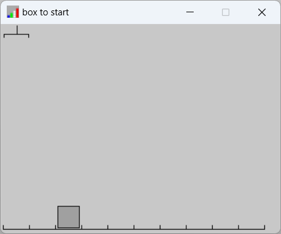
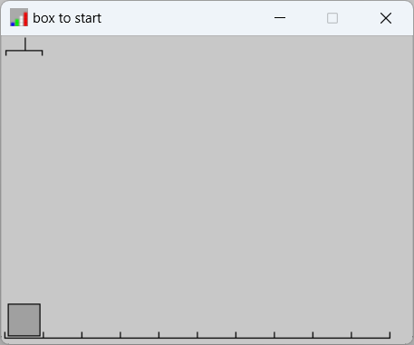
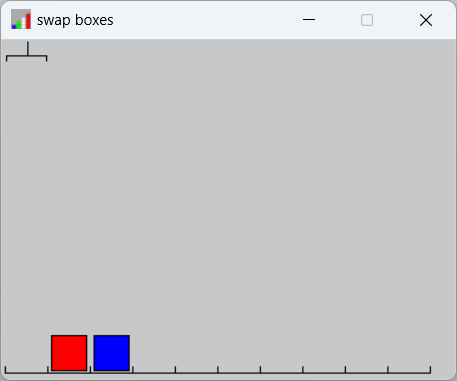
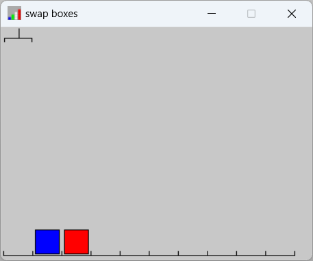
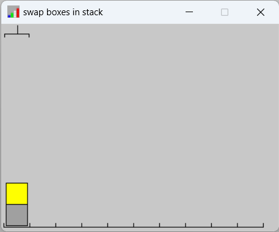
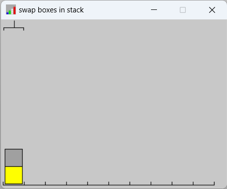
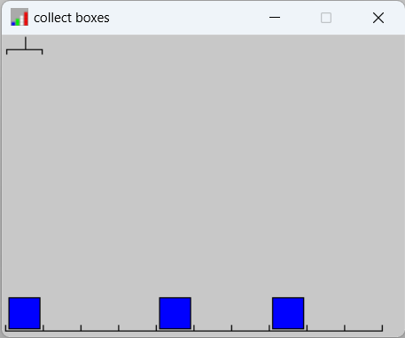
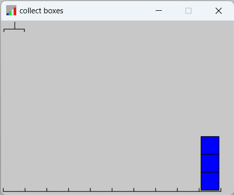
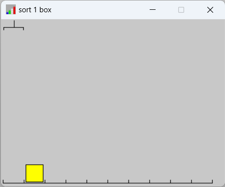
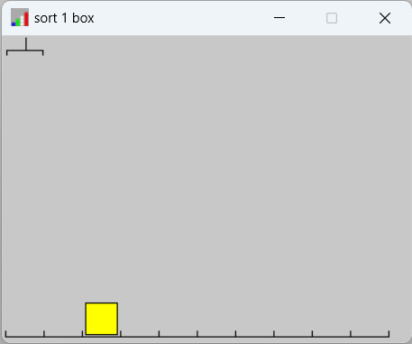

# Robotarm

Lees de instructies op de wiki pagina hoe de robotarm bibliotheek werkt. Vervolgens probeer je de onderstaande 5 basisoefeningen te maken. Na deze oefeningen zijn er vervolg-challenges te vinden in robotArmChallenges.py

## Oefening 1
```python
from RobotArm import RobotArm
from robotArmChallenges import challenges_basic
robotArm = RobotArm(challenges_basic[1],0)

# Jouw python instructies zet je vanaf hier:


# Na jouw code kijken naar het resultaat:
robotArm.report()
```
Verplaats het grijze blok twee plekken naar links. Voorbeelden vóór en ná:




## Oefening 2
```python
from RobotArm import RobotArm
from robotArmChallenges import challenges_basic
robotArm = RobotArm(challenges_basic[2],0)

# Jouw python instructies zet je vanaf hier:


# Na jouw code kijken naar het resultaat:
robotArm.report()
```
Verwissel de blokken. Voorbeelden vóór en ná:




## Oefening 3
```python
from RobotArm import RobotArm
from robotArmChallenges import challenges_basic
robotArm = RobotArm(challenges_basic[3],0)

# Jouw python instructies zet je vanaf hier:


# Na jouw code kijken naar het resultaat:
robotArm.report()
```
Verwissel de blokken. Voorbeelden vóór en ná:




## Oefening 4
```python
from RobotArm import RobotArm
from robotArmChallenges import challenges_basic
robotArm = RobotArm(challenges_basic[4],0)

# Jouw python instructies zet je vanaf hier:


# Na jouw code kijken naar het resultaat:
robotArm.report()
```
Verplaats alle blokken naar het einde. Voorbeelden vóór en ná:




## Oefening 5
```python
from RobotArm import RobotArm
from robotArmChallenges import challenges_basic
robotArm = RobotArm(challenges_basic[5],0)

# Jouw python instructies zet je vanaf hier:


# Na jouw code kijken naar het resultaat:
robotArm.report()
```
Als het blok geel is verplaats hem naar rechts. Als het blok rood is verplaats hem naar links. Voorbeelden vóór en ná:




